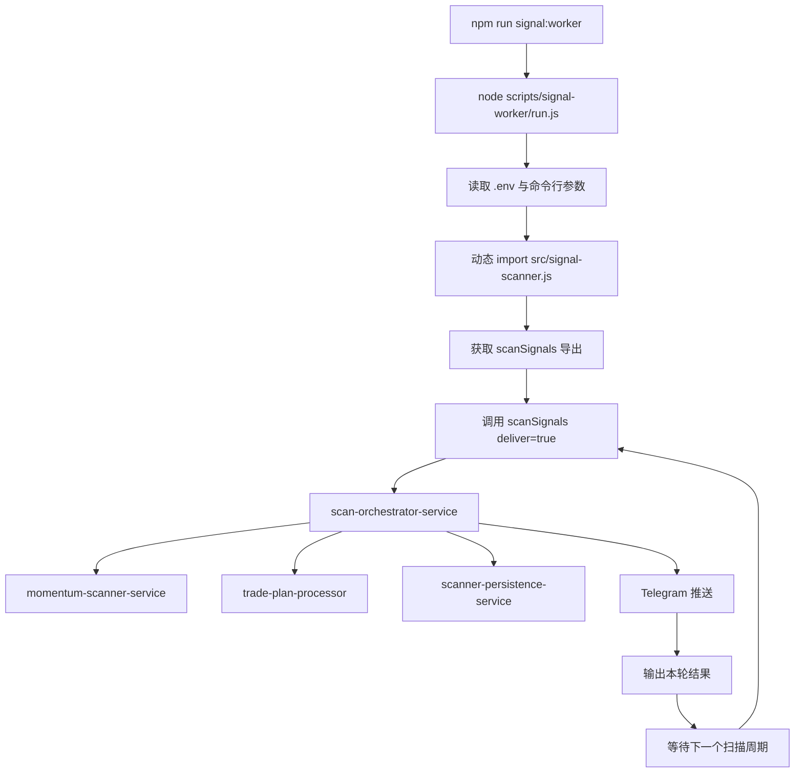
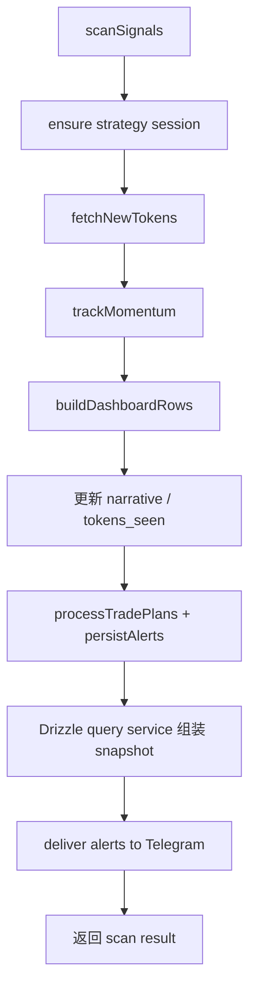
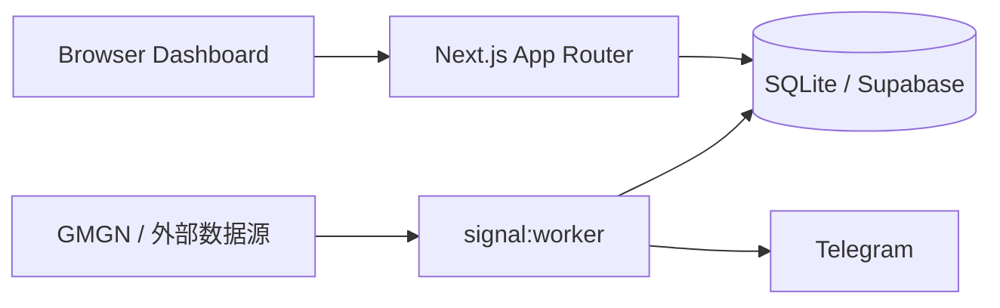

# 2026-05-07 `signal-scanner.js` 优化说明

本文档记录今天对 `src/signal-scanner.js` 的架构优化结果，重点说明：

- 优化后的目录分层
- `signal:worker` 的调用过程
- `signal:worker` 为什么不会占用端口
- 运行时的职责边界

## 一、优化后的核心目录结构

这次重构的目标，不是改变业务行为，而是把原本集中在 `src/signal-scanner.js` 的大体量逻辑拆到更清晰的服务层。

当前和扫描器强相关的目录结构如下：

```text
src/
  signal-scanner.js                              # 组合入口 / 对外导出 / CLI 启动入口

  features/
    signals/
      lib/
        narrative-classifier.js                  # 叙事分类
        paper-trade-settings.js                  # TP/SL 配置纯函数
        signal-formatters.js                     # 展示格式化
        signal-scores.js                         # 分数相关纯函数
        telegram-alert-formatter.js             # Telegram 文案格式化
        token-quality.js                         # 币质量过滤规则

      server/
        gmgn-client.js                           # GMGN API 访问封装
        live-price-snapshot-service.js           # 实时价格与实时快照
        local-signal-store.js                    # 本地 SQLite 初始化与迁移
        momentum-scanner-service.js              # 动量扫描
        paper-position-engine.js                 # 持仓状态推进引擎
        paper-position-lifecycle-service.js      # 持仓生命周期
        paper-position-service.js                # 持仓基础工具
        paper-position-sizer.js                  # 仓位 sizing
        paper-trade-settings-service.js          # 纸交易参数配置
        radar-snapshot-service.js                # Dashboard / Radar 快照组装
        runtime-state-service.js                 # 运行时内存状态
        scan-orchestrator-service.js             # 主扫描编排
        scanner-bootstrap-service.js             # CLI 启动与 worker 循环
        scanner-config-service.js                # 扫描器配置与设置读写
        scanner-external-service.js              # Telegram / GMGN / 外部 IO
        scanner-persistence-service.js           # 持久化与历史快照
        scanner-runtime-meta-service.js          # 运行时元信息
        scanner-runtime.js                       # runtime map / headers / logging 开关
        scanner-trade-service.js                 # trade 评分与交易意图
        signal-query-service.js                  # 给 API route 用的查询服务
        trade-evaluator.js                       # 交易评估规则
        trade-plan-processor.js                  # trade plan 执行

  shared/db/                                     # Drizzle client / schema / repositories
```

## 二、现在 `signal-scanner.js` 的定位

优化后，`src/signal-scanner.js` 不再承担所有业务细节，它现在更接近一个组合根文件：

- 负责加载环境变量和运行时常量
- 负责创建基础依赖，如 `roundTo()`、日志、`fetchJson()`、SQLite 加载
- 负责装配各个 service
- 对外导出 `scanSignals`、`getPersistedSignalSnapshot`、`getRealtimeSignalSnapshot`
- 在 CLI 模式下把执行权交给 `scanner-bootstrap-service.js`

也就是说，现在它已经从“超大业务文件”转成了“入口文件 + composition root”。

## 三、各服务职责

### 1. 配置与启动

- `scanner-config-service.js`
  - 管理 `getRadarConfig()`
  - 管理 `getStoredPaperTradeSettings()`
  - 管理 `updateStoredPaperTradeSettings()`
  - 管理纸交易设置锁定状态

- `scanner-bootstrap-service.js`
  - 负责 worker 启动日志
  - 负责 Telegram 启动通知
  - 负责 `--once` 单轮执行
  - 负责循环扫描调度

### 2. 主扫描流程

- `scan-orchestrator-service.js`
  - 调用 `fetchNewTokens()`
  - 调用 `trackMomentum()`
  - 更新 narrative/runtime state
  - 分支处理 SQLite / Supabase
  - 聚合最终返回结果

- `momentum-scanner-service.js`
  - 负责候选币拉取
  - 负责动量连涨识别
  - 负责质量门槛过滤
  - 负责生成动量 alert

### 3. 交易与持仓

- `scanner-trade-service.js`
  - 负责交易评分
  - 负责交易意图评估
  - 负责交易意图落库
  - 负责纸交易 summary

- `trade-plan-processor.js`
  - 负责把 alert 转成 trade plan
  - 负责处理 SQLite / 内存版 trade plans

- `paper-position-lifecycle-service.js`
  - 负责开仓 / 加仓 / 更新持仓

- `paper-position-engine.js`
  - 负责 TP / SL / trailing stop / time stop 的状态推进

### 4. 快照与持久化

- `scanner-persistence-service.js`
  - 负责 `persistAlerts()`
  - 负责 `getPersistedRadarSnapshot()`
  - 负责持仓历史 backfill

- `radar-snapshot-service.js`
  - 负责 Dashboard rows 组装
  - 负责 `getSignalTimeline()`
  - 负责 `getRecentPersistedAlerts()`

- `live-price-snapshot-service.js`
  - 负责实时价格补齐
  - 负责生成实时 Radar Snapshot

### 5. 外部交互与运行时

- `scanner-external-service.js`
  - 负责 Telegram 推送
  - 负责 GMGN 请求封装
  - 负责 token 描述抓取
  - 负责 Telegram 动量消息格式化

- `runtime-state-service.js`
  - 负责 `tokensSeen` / `narratives` / `momentum` 状态更新

- `scanner-runtime-meta-service.js`
  - 负责策略启动时间
  - 负责 runtime label / runtime seconds

## 四、`signal:worker` 的真实运行方式

`package.json` 中：

```json
{
  "scripts": {
    "signal:worker": "node scripts/signal-worker/run.js",
    "signal:once": "node scripts/signal-worker/run.js --once"
  }
}
```

所以 `signal:worker` 的本质不是“启动一个 Web 服务”，而是：

- 启动一个 Node.js 后台进程
- 反复执行扫描逻辑
- 每轮调用一次 `scanSignals()`
- 结果写入 SQLite / Supabase
- 可选发送 Telegram 消息
- 然后等待下一轮

## 五、调用流程图

### 1. `signal:worker` 启动流程



### 2. `scanSignals()` 内部调用过程



## 六、为什么 `signal:worker` 不占端口

这是理解上的关键点。

### 1. 它是“后台任务进程”，不是“HTTP 服务”

只有当程序执行了下面这类动作，才会占用端口：

- `app.listen(...)`
- `server.listen(...)`
- `createServer(...)`
- `next dev`
- `next start`

而 `scripts/signal-worker/run.js` 做的事情只是：

- 读取配置
- import `src/signal-scanner.js`
- 调用 `scanSignals()`
- `await sleep(...)`
- 再执行下一轮

它没有任何 `listen()` 行为，所以不会绑定任何端口。

### 2. 它更像一个定时执行的 worker / daemon

可以把它理解成：

- 一个常驻 Node 进程
- 定时从 GMGN 拉取数据
- 内部做计算和存储
- 把结果写到数据库
- 可选推送到 Telegram

它类似于：

- 队列消费者
- 定时任务 worker
- 后台扫描守护进程

而不是一个“等浏览器来访问的服务器”。

### 3. 页面能看到数据，不代表 worker 自己提供页面

页面 `/`、`/signals`、`/vault` 是由 Next.js 提供的。

也就是说通常是两个独立进程：

```text
进程 A: npm run dev / npm run start
职责: 提供 Web 页面和 API 路由
特点: 会占用端口，通常是 3000

进程 B: npm run signal:worker
职责: 后台扫描、落库、推送
特点: 不占用 Web 端口
```

所以正确理解是：

- `worker` 负责“生产数据”
- `Next.js` 服务负责“展示数据 / 提供 API”

## 七、运行关系图



这张图说明：

- `worker` 把扫描结果写进存储
- Next.js 页面和 API 从存储里读数据
- 浏览器实际访问的是 Next.js
- 不是访问 `worker`

## 八、实际测试时怎么理解

如果你执行：

```bash
npm run signal:worker
```

你应该把它理解为：

- 启动了一个后台扫描员
- 它会持续工作
- 它不会开放网页入口
- 它不会暴露 `localhost:xxxx`

如果你还执行：

```bash
npm run dev
```

这时：

- `npm run dev` 占用 Web 端口，通常是 `3000`
- `npm run signal:worker` 不占端口，只是持续生产扫描结果

## 九、当前优化后的价值

这次对 `signal-scanner.js` 的拆分，带来的核心收益是：

- 主入口更清晰，便于排查 worker 启动问题
- 不同职责已经切到独立 service，便于单独测试
- worker 的执行链路更容易理解
- 后续要继续做 TypeScript、测试、监控、日志增强时，边界已经更稳定

如果后续继续补文档，可以再新增两份：

- `worker-test-checklist.md`：联调测试清单
- `runtime-state-explained.md`：运行时 map / Supabase / SQLite 状态解释
