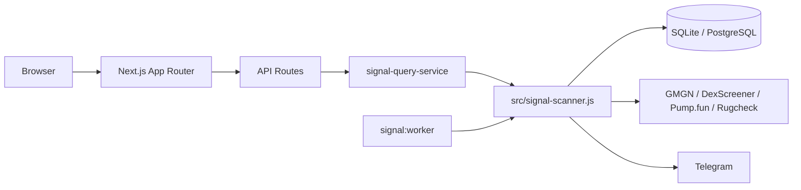
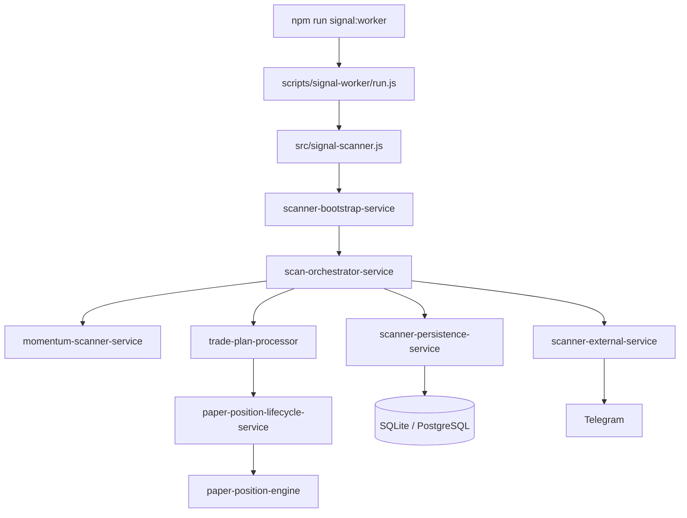
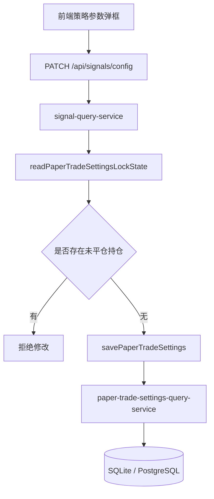

# 项目架构文档

本文档说明当前项目的整体架构、目录分层、核心模块职责，以及 Web、API、Worker、存储之间的调用关系。

## 一、当前定位

项目当前是一个偏策略验证导向的系统，而不是自动实盘系统：

- 前端：`Next.js App Router` 仪表盘
- 后端接口：`Next.js API Routes + SSE`
- 扫描引擎：`Node.js signal worker`
- 数据存储：`SQLite` 或 `PostgreSQL`
- 外部依赖：`GMGN`、`DexScreener`、`Pump.fun`、`Rugcheck`、`Telegram`

这里的 PostgreSQL 可以直接使用：

- 自建 PostgreSQL
- Supabase 提供的 PostgreSQL 连接串

## 二、总体架构

从运行形态上看，项目由两条主线组成：

- Web 主线：负责页面展示、读取快照、配置策略参数
- Worker 主线：负责扫描币种、生成信号、更新持仓、落库存储、推送 Telegram

整体关系如下：



这张图说明：

- 浏览器不会直接驱动 worker
- 页面通过 API 读取快照和策略配置
- worker 负责扫描与写入
- API 与 worker 最终都依赖 `src/signal-scanner.js` 组合出来的能力

## 三、目录结构

当前核心目录如下：

```text
app/
  api/signals/                 # API controller
  components/                  # UI 组件
  page.js                      # 首页 Dashboard
  signals/page.js              # 信号统计页
  vault/page.js                # 持仓与策略页

src/
  config/                      # 应用配置
  lib/                         # 基础工具与 env 兼容层
  modules/signals/client/      # hooks / api client
  modules/signals/lib/         # 领域纯函数
  modules/signals/query/       # 查询层
  modules/signals/server/      # 核心服务层
  shared/db/                   # Drizzle client / schema / repositories
  signal-scanner.js            # 组合入口

scripts/
  signal-worker/run.js         # worker 入口
  telegram/test-bot.js         # Telegram 连通性测试
  maintenance/                 # 清理与重置脚本

docs/
  README.md                    # 当前文档
  策略简略说明.md               # 当前策略说明
  5-7/README.md                # signal-scanner 拆分优化说明
```

## 四、分层职责

### 1. 展示层：`app/`

这一层负责页面组合、交互与渲染，不承载核心扫描逻辑。

主要页面：

- `app/page.js`
  - 首页 Dashboard
  - 展示最新信号、交易状态、动量提示、市场指标
  - 同时接入快照轮询和 SSE

- `app/signals/page.js`
  - 历史聚合信号页
  - 支持排序、搜索、评分提示与时间线

- `app/vault/page.js`
  - 持仓与策略页
  - 展示 open / closed 仓位、账户状态、当前策略摘要

主要组件：

- `app/components/StrategySettingsLauncher.js`
  - 前端策略参数弹框
  - 修改 TP / SL / trailing / time stop

- `app/components/PortfolioCards.js`
  - 持仓卡片与 open / closed 列表

- `app/components/TradeConditionsTooltip.js`
  - 首页交易条件 tooltip
  - 动量提示与交易条件可视化

### 2. API Controller 层：`app/api/signals/*`

这一层负责 request / response，不承载复杂业务编排。

主要接口：

- `app/api/signals/snapshot/route.js`
  - 返回持久化快照
  - 给页面轮询读取列表、统计、持仓摘要

- `app/api/signals/stream/route.js`
  - 提供 SSE 实时流
  - 持续推送实时快照给前端

- `app/api/signals/config/route.js`
  - 读取或更新纸交易参数
  - 修改前会校验是否存在未平仓持仓

### 3. Client Data Layer：`src/modules/signals/client/`

这一层封装前端数据访问逻辑，让页面保持轻量。

主要模块：

- `signal-api-client.js`
  - 统一封装 snapshot / stream 请求

- `use-signal-snapshot.js`
  - 负责轮询
  - 管理 `loading / error / countdown / headerMeta`

- `use-signal-stream.js`
  - 负责 SSE 连接
  - 维护实时连接状态

### 4. Domain Lib 层：`src/modules/signals/lib/`

这一层放纯函数，不直接依赖数据库或副作用。

主要模块：

- `signal-formatters.js`
  - 格式化价格、时间、百分比、金额

- `paper-trade-settings.js`
  - TP / SL / trailing / time stop 纯函数

- `token-quality.js`
  - 质量过滤与买卖比计算

- `narrative-classifier.js`
  - 叙事主题分类

- `telegram-alert-formatter.js`
  - Telegram 文案拼装

### 5. Query 层：`src/modules/signals/query/`

这一层负责从数据库或快照中读取前端所需数据，并做展示聚合。

主要模块：

- `persisted-signal-query-service.js`
  - 读取持久化快照
  - 聚合 alerts、paperSummary、signalTimeline、config

- `realtime-signal-query-service.js`
  - 生成实时快照
  - 为 SSE 与前端最新状态服务

- `paper-trade-settings-query-service.js`
  - 读取、写入、锁定检查纸交易参数

### 6. Server Service 层：`src/modules/signals/server/`

这是当前项目最核心的业务层。

#### 查询边界

- `signal-query-service.js`
  - API 与 `signal-scanner.js` 之间的边界
  - 对外暴露快照、实时快照、策略配置读写能力

#### 扫描与编排

- `scan-orchestrator-service.js`
  - 单轮扫描主编排
  - 串联候选币获取、动量识别、交易处理、快照同步、Telegram 推送

- `momentum-scanner-service.js`
  - 候选币获取
  - 动量检测
  - 质量过滤
  - 生成 alert

- `scanner-bootstrap-service.js`
  - worker 启动、循环调度、单轮执行

#### 交易与持仓

- `scanner-trade-service.js`
  - 交易评分
  - 交易意图判断
  - 账户维度交易统计

- `trade-evaluator.js`
  - 交易评分与开仓门槛规则
  - 第 1 次 / 第 2 次信号判断逻辑

- `trade-plan-processor.js`
  - 把 alert 转成 trade plan
  - 执行开仓、跳过、持仓更新

- `paper-position-lifecycle-service.js`
  - 开仓、扩展仓位、更新持仓生命周期

- `paper-position-engine.js`
  - TP / SL / trailing / time stop 推进

- `paper-position-sizer.js`
  - 目标仓位 sizing

- `paper-trade-settings-service.js`
  - 参数标准化、读取、写入、同步到 open position

#### 快照与持久化

- `radar-snapshot-service.js`
  - 组装 Dashboard / Vault 所需数据

- `live-price-snapshot-service.js`
  - 生成实时 snapshot
  - 补充当前价格与持仓状态

- `scanner-persistence-service.js`
  - 持久化 alerts、trade intents、positions、snapshot

#### 外部服务

- `gmgn-client.js`
  - GMGN 请求封装

- `scanner-external-service.js`
  - Telegram 推送
  - token 描述抓取

#### 运行时服务

- `runtime-state-service.js`
  - 维护 tokensSeen / momentum runtime 状态

- `scanner-runtime-meta-service.js`
  - 管理 startedAt / strategyRuntime 等运行时元信息

- `scanner-runtime.js`
  - runtime map 初始化
  - headers 构建
  - 文件日志开关判断

### 7. Infrastructure 层：`src/lib/` + `src/shared/db/`

这一层负责底层基础设施与存储适配。

主要模块：

- `src/shared/db/client/*`
  - Drizzle 多驱动 client

- `src/shared/db/schema/*`
  - SQLite / PostgreSQL schema

- `src/shared/db/repositories/*`
  - 仓储层封装

- `src/lib/signal-env.js`
  - `SIGNAL_*` 与 `RADAR_*` 环境变量兼容映射

- `src/lib/outbound-http.js`
  - 出站 HTTP 请求封装
  - 支持代理与超时控制

- `src/lib/bignumber-utils.js`
  - 金额与精度计算工具

## 五、核心运行入口

### 1. Web 入口

开发环境：

```bash
npm run dev
```

生产 Web 服务：

```bash
npm run build
npm start
```

职责：

- 提供页面
- 提供 `/api/signals/*`
- 提供 SSE 实时流

### 2. Worker 入口

常驻运行：

```bash
npm run signal:worker
```

只跑一轮：

```bash
npm run signal:once
```

职责：

- 周期性扫描候选币
- 生成动量信号和交易评分
- 更新纸交易持仓
- 写入 SQLite / PostgreSQL
- 推送 Telegram

注意：

- `signal:worker` 是独立后台进程
- 它不会占用 Web 端口
- 页面与 API 来自 Next.js，而不是 worker

## 六、关键调用过程

### 1. 页面读取数据

```mermaid
flowchart TD
    A[Browser] --> B[useSignalSnapshot]
    A --> C[useSignalStream]
    B --> D[/api/signals/snapshot]
    C --> E[/api/signals/stream]
    D --> F[signal-query-service]
    E --> F
    F --> G[src/signal-scanner.js]
    G --> H[query services]
    H --> I[(SQLite / PostgreSQL)]
```

说明：

- 前端同时使用轮询和 SSE
- API Route 只做 controller
- 真实读取逻辑由 query 层与 `signal-scanner.js` 提供

### 2. Worker 扫描流程



说明：

- worker 负责扫描、计算、落库、推送
- `signal-scanner.js` 现在主要承担组合入口角色

### 3. 实时快照流程

```mermaid
flowchart TD
    A[SSE 连接] --> B[/api/signals/stream]
    B --> C[readRealtimeSignalSnapshot]
    C --> D[signal-query-service]
    D --> E[src/signal-scanner.js]
    E --> F[live-price-snapshot-service]
    F --> G[返回 realtime snapshot]
    G --> H[浏览器更新列表与持仓]
```

说明：

- 浏览器看到的“实时状态”不是 worker 主动直推
- 而是浏览器保持 SSE 连接，由 Next.js 服务周期性返回实时快照

### 4. 策略参数更新流程



说明：

- 前端不会直接写数据库
- 存在 open positions 时，策略参数会被锁定

## 七、当前架构特点

相对于早期“单文件承载大量逻辑”的方式，现在的主要收益是：

- 页面更轻，展示层与数据层边界更清晰
- API Route 更像 controller，职责单一
- `signal-scanner.js` 作为组合入口，文件压力下降
- query / server / infra 层次更明确
- SQLite / PostgreSQL 双驱动更容易维护
- 后续继续补 TypeScript、测试、监控会更容易

## 八、建议阅读顺序

如果新同事要快速理解项目，建议按下面顺序阅读：

1. `package.json`
2. `README.md`
3. `app/page.js`
4. `app/signals/page.js`
5. `app/vault/page.js`
6. `app/api/signals/snapshot/route.js`
7. `src/modules/signals/server/signal-query-service.js`
8. `src/signal-scanner.js`
9. `src/modules/signals/server/scan-orchestrator-service.js`
10. `src/modules/signals/server/momentum-scanner-service.js`
11. `src/modules/signals/server/trade-plan-processor.js`
12. `src/modules/signals/query/persisted-signal-query-service.js`
13. `src/shared/db/repositories/index.js`

## 九、一句话总结

这个项目当前是一个“Next.js 看板 + Node.js 信号扫描 worker + SQLite / PostgreSQL 存储 + Telegram 推送”的分层架构。

其中：

- Next.js 负责展示、API、实时流
- worker 负责扫描、计算、落库、推送
- `signal-scanner.js` 负责组合服务
- `src/modules/signals/query/` 负责前端可读数据聚合
- `src/modules/signals/server/` 负责核心业务编排
- `src/shared/db/` 与 `src/lib/` 负责存储和基础设施
