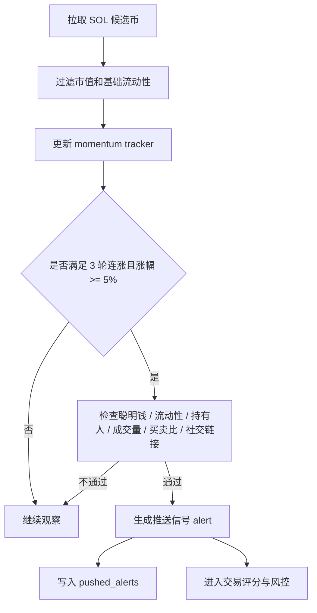
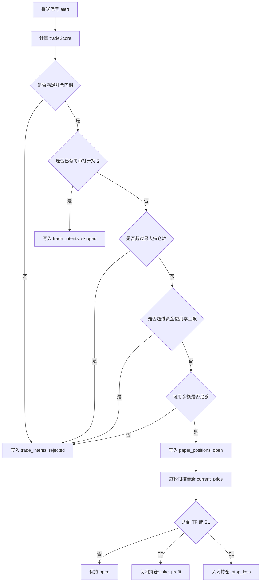

# 当前策略与实现说明

这份文档用于说明当前项目到底在做什么、怎么做、做到哪一步了。

适合在你回看项目时快速回答 3 个问题：

- 当前策略怎么触发信号
- 当前纸上交易怎么开仓和平仓
- 当前前端页面和后端数据是怎么串起来的

## 1. 项目当前定位

当前项目不是实盘交易系统，而是一个 `SOL Meme 雷达 + 纸上交易 + 前端看板` 系统。

它的目标是：

- 从 GMGN 拉取 `SOL` 新币和热门候选
- 用动量规则筛选出值得关注的 Meme
- 用更严格的交易评分和风控规则决定是否纸上开仓
- 用 SQLite 持久化历史信号、交易意图、持仓和已平仓结果
- 在 Next.js 页面里实时展示账户、持仓、已平仓和推送 Token

一句话概括：

> 现在项目已经从“只看信号”进化到“能持续复盘的纸上交易面板”，但还没有进入真实下单阶段。

## 2. 当前整体架构

```mermaid
flowchart TD
    A[GMGN 行情接口] --> B[src/trading-radar.js]
    B --> C[候选币过滤]
    C --> D[动量追踪]
    D --> E[推送信号]
    E --> F[交易评分与风控]
    F --> G[paper_positions / trade_intents]
    G --> H[SQLite .radar-data]
    H --> I[/api/radar/scan]
    H --> J[/api/radar/stream]
    I --> K[Next.js 页面]
    J --> K
```

## 3. 当前代码里的关键入口

- 核心引擎：`src/trading-radar.js`
- 页面接口：
  - `app/api/radar/scan/route.js`
  - `app/api/radar/stream/route.js`
- 前端页面：`app/page.js`
- 本地数据：
  - SQLite：`.radar-data/narrative_history.db`
  - 日志：`.radar-data/narrative_radar.log`

## 4. 当前扫描范围和基础参数

当前策略是一个偏保守的 `v1.1` 纸上交易版本。

### 扫描层

- 只扫描 `SOL`
- 扫描间隔：`30s`
- 候选来源：
  - 按 `open_timestamp` 排序的 1h swaps
  - 按 `swaps` 排序的 1h swaps
- 候选数量：
  - 第一组 `limit=100`
  - 第二组 `limit=50`

### 候选过滤

- 最小市值：`1000`
- 最大市值：`10,000,000`
- 最小基础流动性：`500`

### 推送层门槛

- 最小聪明钱：`2`
- 最小流动性：`3000`
- 最小持有人：`50`
- 最小 1h 成交量：`10000`
- 最小买卖比：`1.1`
- 默认要求至少有一个社交/官网链接

## 5. 当前信号逻辑

当前项目的核心不是“叙事驱动”，而是“动量驱动”。

叙事只负责分类展示，不决定是否推送。

### 当前触发条件

- 连续 `3` 轮上涨
- 累计涨幅 `>= 5%`
- 满足推送层的质量过滤

### 当前推送逻辑本质

- 有动量，才可能推送
- 有叙事，不等于推送
- 叙事只作为标签出现在 UI 和消息里

### 当前叙事分类

- `★★★` 马斯克 / 川普
- `★★★` 币安 / CZ
- `★★` 名人 / 热点
- `★` 无明确叙事

## 6. 单轮扫描流程



## 7. 当前交易层逻辑

当前交易层和推送层是分开的。

也就是说：

- 一个币可以被推送很多次
- 但不一定会被买入

### 交易层的核心思路

推送解决“值得看”

交易解决“值不值得买”

### 当前开仓门槛

- `tradeScore >= 80`
- 只允许第 `1` 次信号开仓
- 最小聪明钱：`3`
- 最小流动性：`5000`
- 最小 1h 成交量：`20000`
- 最小买卖比：`1.2`

### 当前评分项

#### 加分项

- 聪明钱越多，加分越高
- 越早的信号，加分越高
- 流动性越高，加分越高
- 1h 成交量越高，加分越高
- 买卖比越高，加分越高

#### 扣分项

- `1h` 涨幅过热会扣分
- `>= 50%` 扣 `12`
- `>= 80%` 扣 `20`

这个设计的含义是：

> 当前策略不鼓励追已经极度爆拉的币。

## 8. 当前纸上账户风控

当前纸上账户是固定资金模型，不是无限开仓。

### 账户参数

- 总资金：`1000 USD`
- 基础仓位：`60 USD`
- 最多打开持仓：`4`
- 资金使用率上限：`50%`

### 仓位大小

实际仓位不是固定 60，而是根据 `聪明钱 + tradeScore` 动态调整。

大致逻辑：

- 默认倍率：`0.25`
- 聪明钱 `>= 3`：提高到 `0.5`
- 聪明钱 `>= 5`：提高到 `0.75`
- 聪明钱 `>= 8`：提高到 `1`
- 如果 `tradeScore >= 85`：再额外加 `0.25`

所以真实仓位会落在一个区间里，而不是所有币都同样重仓。

## 9. 当前开仓到平仓的流程



## 10. 当前止盈止损逻辑

- 止盈：`+20%`
- 止损：`-25%`

每一轮扫描会检查所有打开中的 `paper_positions`：

- 如果最新价格 `>= TP` 价格，平仓
- 如果最新价格 `<= SL` 价格，平仓
- 否则只更新浮动盈亏

当前没有：

- 移动止损
- 分批止盈
- 手动加仓
- 手动减仓

## 11. 当前数据库里保存了什么

### `pushed_alerts`

保存每一次真正触发的推送信号。

用途：

- 前端展示推送列表
- 统计某个 Token 出现过几次
- 记录每次信号时的价格和时间

### `trade_intents`

保存每一次“是否应该开仓”的判定结果。

用途：

- 看某个币为什么没买
- 看被拒绝的原因
- 做后续策略复盘

### `paper_positions`

保存纸上持仓。

用途：

- 看当前打开持仓
- 看已平仓结果
- 计算账户权益、浮动盈亏、已实现盈亏

### `radar_meta`

保存运行态元数据。

用途：

- 最近扫描时间
- 当前策略 session 启动时间
- 策略已运行多久

## 12. 当前前端页面展示逻辑

前端不是直接扫链，而是通过两个接口拿数据。

### `/api/radar/scan`

用途：

- 拉取最新快照
- 如果最近 `25s` 内已经扫过，优先返回持久化结果
- 否则触发一次新的扫描

### `/api/radar/stream`

用途：

- 用 `SSE` 每 `5s` 推送一次实时快照
- 前端用它更新价格、账户权益和持仓状态

### 当前页面重点

顶部：

- 策略已运行多久
- 策略启动时间
- 实时连接状态
- 最近实时更新时间
- 最近扫描时间

中间统计：

- 账户权益
- 可用余额
- 打开持仓
- 资金使用率
- 浮动盈亏
- 已实现盈亏
- 推送数

下方：

- `持仓中`
- `已平仓`
- `推送 Token`

## 13. 当前项目已经完成的部分

### 已完成

- Node.js 版 GMGN 雷达主逻辑
- SOL-only 扫描
- 动量信号识别
- 推送质量过滤
- SQLite 持久化
- 纸上账户模型
- 开仓 / 持仓 / 平仓
- 持仓和已平仓面板
- SSE 实时快照
- 策略运行时间以后端 session 为准
- 策略复盘文档持续沉淀

### 还没有完成

- 真正调用 GMGN 下单
- 实盘钱包托管和签名执行
- 分批止盈 / 移动止损
- 多策略并行
- 回测系统
- 更完整的风险报表

## 14. 当前项目处于什么阶段

当前项目处于：

> `信号系统 -> 交易打分 -> 纸上执行 -> 前端复盘`

这个阶段。

它已经不是“原型 demo”，但也还不是“真实自动交易系统”。

更准确地说，它现在是一个：

> 可以持续跑、可以持续观察、可以持续调策略的纸上交易实验平台。

## 15. 当前版本最重要的理解

你现在要区分 4 层：

### 第 1 层：候选层

从 GMGN 拉回来的所有候选 Meme。

### 第 2 层：推送层

满足动量和质量门槛，值得出现在你面前。

### 第 3 层：交易层

满足 tradeScore 和风控，才允许纸上开仓。

### 第 4 层：复盘层

把推送、意图、持仓、盈亏全都存下来，方便你调策略。

如果你看到一个币“出现了很多次但没买”，通常不是 bug，而是：

- 它通过了推送层
- 但没有通过交易层

## 16. 你接下来应该重点看什么

如果你的目标是继续优化策略，优先看这几项：

- 哪些币被频繁推送但长期不买
- 哪些币开仓后最常因什么原因平仓
- `tradeScore >= 80` 是否过严或过松
- `TP +20% / SL -25%` 是否合理
- 最大持仓数和资金使用率是否还需要继续收紧

## 17. 后续建议路线

建议按这个顺序继续演进：

1. 继续跑纸上账户，观察足够多样本
2. 补充“拒单原因”和“开仓原因”的前端展示
3. 加入更细的风险指标
4. 做分批止盈 / 移动止损
5. 最后再考虑接入真实交易

---

如果后面策略继续变化，这份文档建议作为“当前版本说明书”持续更新；而每次具体策略调整，继续写到 `docs/策略复盘/` 目录里。
