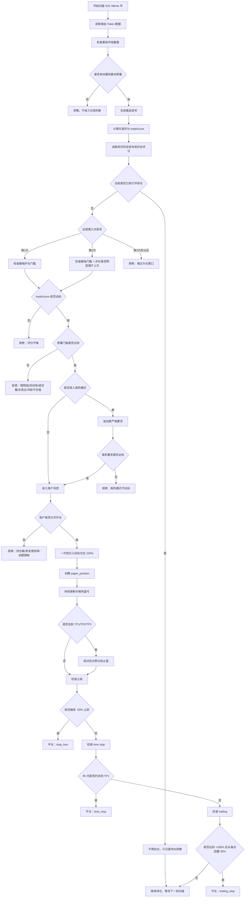

# 当前策略白话说明

这份文档用尽量通俗的话说明当前策略到底怎么运行：它怎么找币、什么时候买、为什么不买、买多少、什么时候卖，以及前端页面里看到的状态是什么意思。

一句话总结：

> 系统先找“最近明显有资金和热度的 Meme 币”，再用交易评分和硬性风控判断能不能买；一旦买入，就一次性买满目标仓位，后面不再补仓，只靠止盈、止损、时间退出和 trailing 来管理仓位。

---

## 1. 这个系统是什么

当前系统不是实盘自动交易机器人，而是一个链上模拟交易系统。

你可以把它理解成一个自动复盘助手：

- 它会不断扫描 SOL 链上的 Meme 币
- 它会挑出最近有动静的币
- 它会判断这些币值不值得模拟买入
- 如果通过规则，就在纸上账户里记录一笔模拟持仓
- 持仓之后，它会继续观察价格变化
- 到了止盈、止损、时间退出或 trailing 条件，就模拟卖出
- 最后把每一步原因展示到前端，方便复盘

所以它的核心目的不是“马上实盘下单”，而是先把一套 Meme 交易策略跑清楚、看清楚、复盘清楚。

---

## 2. 当前策略最重要的原则

当前策略有 5 条核心原则：

1. **不是什么币都看**
   - 太冷、太老、流动性太差、买盘太弱的币会被过滤掉。

2. **不是价格一涨就买**
   - 真正决定买不买的是交易评分 `tradeScore`。
   - 价格涨幅只是评分的一部分，不是单独触发买入的按钮。

3. **只买头仓，不做分批加仓**
   - 买入时直接买满目标仓位的 `100%`。
   - 买完之后，同一个币后续再出现信号，也不会继续加仓。

4. **第 1 次信号优先，第 2 次信号只给一次补救机会**
   - 第 1 次信号最优先。
   - 如果第 1 次没买，第 2 次只有明显变强才允许补开头仓。
   - 第 3 次及以后，不再允许新开头仓。

5. **Meme 波动大，止损放宽，止盈靠分批卖出**
   - 默认止损比较宽，是为了避免普通波动把仓位洗掉。
   - 止盈会分 3 档，先收回本金，再保留尾仓吃大行情。

---

## 3. 系统先怎么找币

系统会从 GMGN 拉取 SOL 链上的候选 Token。

但拉到的币不会马上买，而是先做第一层筛选。

它会重点看这些信息：

- 这个币是不是太老
- 流动性够不够
- 1 小时成交量够不够
- 有没有聪明钱参与
- 买卖比是不是健康
- 最近 1 小时涨幅是不是过热
- 是否连续出现动量信号

这一层可以理解成：

> 先从市场里把“有动静、有资金、有成交”的币捞出来，明显不行的先不要浪费时间。

---

## 4. 买入触发核心是什么

当前买入触发核心是：

> `tradeScore`，也就是交易评分。

不是单独的价格评分。

价格相关指标确实会影响策略，但它们只是交易评分的一部分。例如：

- 扫描窗口内涨幅不错，会加分
- 1 小时涨幅太夸张，会扣分
- 高热状态下，会要求更高的评分和更强的买盘

所以不要把当前策略理解成：

> 价格涨了多少，所以系统买。

更准确的理解是：

> 价格、成交量、聪明钱、流动性、买卖比、币龄等因素合起来形成交易评分；评分和硬性门槛都过了，系统才允许买。

---

## 5. 交易评分大概看什么

交易评分 `tradeScore` 会综合考虑这些因素：

### 5.1 聪明钱

聪明钱越多，说明可能有更强资金关注。

当前基础要求：

- 聪明钱数量至少 `3`

如果聪明钱更强，会给交易评分加更多分。

### 5.2 流动性

流动性太差的币，买进去和卖出来都容易出问题。

当前基础要求：

- 流动性至少 `15000`

如果流动性更高，也会加分。

### 5.3 1 小时成交量

成交量代表市场参与度。

当前基础要求：

- 1 小时成交量至少 `30000`

量越高，评分越容易上去。

### 5.4 买卖比

买卖比代表买盘和卖盘的强弱关系。

当前基础要求：

- 买卖比至少 `1.4`

如果买卖比太低，说明卖压偏强，会被拒绝。

### 5.5 币龄

太老的币，早期爆发机会可能已经过去。

当前基础要求：

- Token 币龄不能超过 `48h`

### 5.6 价格动量

如果短时间内有明显涨幅，说明这个币正在动。

但这里有一个重要细节：

- 适度上涨会加分
- 涨得太夸张会扣分

因为 Meme 很容易出现“已经拉爆，后面接盘风险很高”的情况。

---

## 6. 什么情况下可以买

当前开仓分两种情况。

### 6.1 第 1 次信号开头仓

第 1 次信号是最标准的开仓机会。

需要同时满足：

- 没有同币打开中的持仓
- 当前是第 `1` 次信号
- `tradeScore >= 64`
- 聪明钱 `>= 3`
- 流动性 `>= 15000`
- 1 小时成交量 `>= 30000`
- 买卖比 `>= 1.4`
- Token 币龄 `<= 48h`
- 没有触发高热模式的额外限制
- 账户层面允许继续开仓

账户层面的限制包括：

- 最多打开持仓数：`4`
- 总资金使用率上限：`25%`
- 单币最大目标仓位：总资金的 `10%`
- 纸上账户还有可用资金

如果这些都满足，系统会模拟买入。

买入方式是：

> 一次性买满目标仓位的 `100%`。

---

### 6.2 第 2 次信号补开头仓

第 2 次信号不是无条件能买。

它只是给第 1 次错过的币一个补救机会。

第 2 次信号想补开头仓，需要满足：

- 当前还没有同币打开中的持仓
- 当前是第 `2` 次信号
- 有上一轮信号评分记录
- 当前 `tradeScore >= 68`
- 当前评分比上一次至少高 `5` 分
- 同时仍然满足所有基础开仓门槛

也就是说，第 2 次信号必须明显比第 1 次更强，系统才会认为：

> 这个币不是单纯重复推送，而是真的变强了。

如果只是差不多，或者只强一点点，不买。

---

## 7. 什么情况下不会买

下面这些情况都会导致不买。

### 7.1 评分不够

如果 `tradeScore < 64`，不买。

第 2 次补开头仓更严格：

- 必须 `tradeScore >= 68`
- 还要比上一次至少强 `5` 分

### 7.2 基础质量不够

下面任意一项不满足，都会拒绝：

- 聪明钱低于 `3`
- 流动性低于 `15000`
- 1 小时成交量低于 `30000`
- 买卖比低于 `1.4`
- 币龄超过 `48h`

### 7.3 已经过了头仓窗口

当前只允许第 1 次和第 2 次信号开头仓。

如果一个币到第 3 次信号才满足条件，但之前没有买入，也不会再开新头仓。

原因很简单：

> Meme 越往后追，接盘风险越高。

### 7.4 已经有持仓

如果同一个币已经有打开中的持仓，后续信号不会继续买。

系统会记录为：

> 已持有目标仓位，当前策略不再分批加仓。

也就是说，当前策略没有“越涨越补”的逻辑。

---

## 8. 高热模式是什么

如果一个币 1 小时涨幅达到 `50%` 或以上，系统会进入高热模式。

高热模式不是直接禁止买，而是提高要求。

高热模式下，需要满足：

- `tradeScore >= 68`
- 聪明钱 `>= 5`
- 流动性 `>= 30000`
- 买卖比 `>= 1.6`

为什么要这样？

因为 1 小时涨幅太高的币，可能确实很强，但也可能已经接近短线高潮。

所以策略会说：

> 可以买，但你必须证明自己真的足够强。

---

## 9. 买多少

当前是纸上账户。

默认账户参数：

- 总资金：`1000 USD`
- 基础仓位：`40 USD`
- 最多打开持仓：`4`
- 资金使用率上限：`25%`
- 单币最大目标仓位：总资金的 `10%`

仓位大小会根据交易评分和聪明钱强度做一些调整。

简单理解：

- 普通通过的币，仓位会比基础仓位略小
- 评分很高的币，仓位会接近或略高于基础仓位
- 单个币不会超过账户总资金的 `10%`

最重要的是：

> 当前买入不是分三段买，而是头仓一次性买入目标仓位的 `100%`。

---

## 10. 买入之后怎么管理

买入之后，系统不会再加仓。

后续只做 4 件事：

1. 更新当前价格
2. 计算浮动盈亏
3. 检查是否触发止盈
4. 检查是否触发止损、时间退出或 trailing

---

## 11. 止盈规则

当前默认止盈分 3 档。

### TP1

- 价格上涨 `+80%`
- 卖出总仓位的 `55%`

这一档的目的：

> 先收回大部分本金，同时锁定一部分利润。

### TP2

- 价格上涨 `+150%`
- 卖出总仓位的 `25%`

这一档的目的：

> 如果行情继续走强，兑现中段利润。

### TP3

- 价格上涨 `+260%`
- 卖出最后 `20%`

这一档的目的：

> 给极端拉升留一点尾仓，不要太早全部卖飞。

简单说，当前止盈结构是：

> 第一档回收本金，第二档吃主升，第三档赌极端 Meme 爆发。

---

## 12. 止损规则

当前默认止损是：

- `-50%`

最大允许配置到：

- `-80%`

为什么止损这么宽？

因为 Meme 波动很大。

如果止损太窄，很多币可能还没真正走出来，就先被普通波动洗掉。

但这也有代价：

> 止损越宽，单笔亏损越大，所以必须依赖前面的开仓过滤和后面的止盈来平衡。

---

## 13. 时间退出

当前默认时间退出是：

- 持仓超过 `8h`
- 还没有达到 TP1
- 就直接平仓

这条规则是为了处理一种情况：

> 买进去以后一直不涨，也不大跌，资金被卡住。

对于 Meme 来说，如果一个信号真的强，通常不应该太久都打不到第一档止盈。

所以时间退出的作用是：

> 不让弱势票长期占用仓位。

---

## 14. Trailing 是什么

Trailing 可以理解成“移动保护止盈”。

当前默认设置：

- 当价格最高涨幅达到 `+180%` 后，启动 trailing
- 启动后，如果从最高点回撤 `35%`，就平掉剩余仓位

举个例子：

如果买入价是 `1`，价格最高涨到 `3`，说明涨幅达到 `+200%`，trailing 已经启动。

如果之后价格从最高点 `3` 跌到 `1.95` 附近，回撤达到约 `35%`，系统就会卖掉剩余仓位。

这条规则的目的：

> 不在强势趋势刚开始时过早卖掉尾仓，但在大幅回落时保护已经到手的利润。

---

## 15. 整体策略执行流程图

---

## 16. 从买入到卖出的简单例子

假设某个 Meme 币第一次出现信号。

系统发现：

- 交易评分是 `70`
- 聪明钱是 `5`
- 流动性是 `50000`
- 1 小时成交量是 `120000`
- 买卖比是 `1.8`
- 币龄是 `10h`

这些条件都满足，所以系统模拟开仓。

如果目标仓位是 `40 USD`，它会一次性买入 `40 USD`。

后面可能出现这些情况：

### 情况 A：上涨到 +80%

触发 TP1，卖出 `55%`。

### 情况 B：继续上涨到 +150%

触发 TP2，再卖出 `25%`。

### 情况 C：继续上涨到 +260%

触发 TP3，卖掉最后 `20%`。

### 情况 D：没有涨起来，跌到 -50%

触发止损，平仓。

### 情况 E：8 小时还没到 +80%

触发时间退出，平仓。

### 情况 F：大涨后又大幅回落

如果最高涨幅已经超过 `+180%`，后面从最高点回撤 `35%`，触发 trailing，平掉剩余仓位。

---

## 17. 前端页面怎么看

### 首页

首页主要看最新信号。

你可以看到：

- 哪些币被推送
- 交易评分是多少
- 系统为什么买或为什么不买
- 当前是头仓、补开头仓，还是持仓观察
- 策略止盈止损标签

### 信号页

信号页更适合做复盘。

你可以看：

- 同一个币多次出现信号时，评分有没有变强
- 第 1 次为什么没买
- 第 2 次有没有满足补开头仓
- 被拒绝的主要原因是什么

### 持仓页

持仓页主要看纸上账户状态。

你可以看：

- 当前账户余额
- 可用余额
- 浮动盈亏
- 已实现盈亏
- 当前打开中的持仓
- 已关闭持仓
- 每个仓位的止盈止损参数和退出原因

---

## 18. 当前策略的优点和风险

### 优点

- 买入逻辑清楚，不会无限追涨
- 第 2 次信号只给一次补救机会
- 不做分批加仓，仓位结构更简单
- 止盈分 3 档，既能回收本金，也能保留尾仓
- 止损较宽，更适合 Meme 的高波动
- 所有买入和拒绝原因都会记录，方便复盘

### 风险

- 止损宽，单笔亏损可能比较大
- 如果开仓过滤不够准，连续亏损会比较伤
- 第 3 次以后不再开仓，可能错过一些后启动的币
- TP1 设置在 `+80%`，如果行情只小涨后回落，可能拿不到利润
- trailing 启动较晚，适合吃大波段，但不适合很短线的快进快出

---

## 19. 最后再用一句话记住

> 当前策略不是“价格一涨就买”，而是“交易评分和质量门槛都过了才买”；买入后一次性建满，不再加仓；卖出靠 TP1/TP2/TP3、-50% 止损、8h 时间退出和高位 trailing 来管理。
