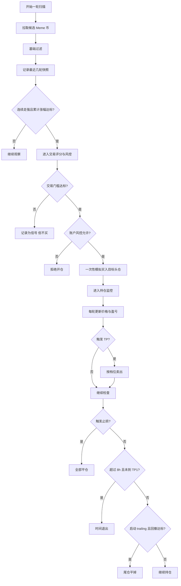

# 当前项目策略简略说明

## 1. 这套策略到底在做什么

这不是一套抄底策略，也不是长期持有策略。

当前项目做的是一套偏短线的 `SOL Meme` 动量策略，核心可以概括为：

> 找市场里刚开始变强、链上数据也配合的新币，做一次性纸上头仓，然后按固定规则分批止盈和退出。

它现在的定位仍然是：

- 自动扫描候选币
- 自动生成信号
- 自动做纸上模拟开平仓
- 自动在 Web 看板和 Telegram 中展示结果

所以更准确地说，它是“自动信号 + 自动纸上交易”，不是实盘自动下单。

---

## 2. 策略的整体节奏

可以把当前策略理解成 5 步：

1. 从外部数据源拉一批候选 Meme 币
2. 检查最近几轮是否连续走强
3. 检查链上质量和基础交易门槛
4. 计算 `tradeScore`，决定是否具备开仓资格
5. 买入后只做持仓管理，不再继续加仓

也就是说，这套策略不是“看到信号就买”，而是：

> 先筛选，再确认，再进场，再用固定退出规则管理仓位。

---

## 3. 当前在扫描什么

每轮扫描时，程序会先从外部数据源拉取候选 Token。

但不是所有币都会进入交易判断，系统先会做基础过滤，比如：

- 市值区间是否合适
- 流动性是否过低
- 是否属于明显噪音币
- 是否满足最基本的质量门槛

所以第一步不是“扫全市场所有币”，而是：

> 先过滤掉明显不值得看的币，只留下可能存在机会的那一小批。

---

## 4. 什么叫“信号触发”

当前策略核心不是叙事，而是动量。

这里的动量可以简单理解为：

- 最近连续几轮扫描都在走强
- 不是只涨一下，而是连续推进
- 这几轮累计涨幅达到最低门槛

当前默认方向可以理解为：

- 连续 `3` 轮向上
- 累计涨幅至少 `5%`

如果一个币只是偶尔抽一下，或者涨得不连贯，通常不会进入信号阶段。

所以“信号触发”的本质是在找：

> 刚开始形成趋势的币，而不是猜底部。

---

## 5. 有信号不等于可以买

这是最容易误解的一点。

一个币通过动量阶段，只说明：

> 它开始变强了，值得继续评估。

真正能不能开仓，还要通过交易风控。

这层风控会看：

- 交易评分
- 聪明钱
- 流动性
- 1h 成交量
- 买卖比
- 币龄
- 当前是否已经过热
- 这是第几次出现信号

所以“有信号”和“可开仓”是两个阶段。

---

## 6. 交易评分如何理解

系统会给每个候选信号计算一个 `tradeScore`。

它不是拍脑袋的分数，而是多种因素共同加减后的结果。

典型加分项：

- 聪明钱更多
- 流动性更高
- 成交量更好
- 买卖比更健康
- 币龄较早
- 第 1 次信号
- 扫描窗口涨幅较好

典型减分项：

- 已经出现过很多次信号
- 1h 涨幅太夸张，进入过热区
- 买卖比偏弱

默认情况下，基础开仓门槛大致是：

- `tradeScore >= 64`

更准确地说，这个分数不是在回答“它会不会涨”，而是在回答：

> 它是否值得我承担一次有限风险去试错。

---

## 7. 当前开仓规则

当前策略非常强调“头仓时机”。

### 第 1 次信号

基础思路是：

- 第 1 次信号最有价值
- 只要评分和质量门槛达标，就允许建立头仓

典型基础门槛包括：

- `tradeScore >= 64`
- `smartMoney >= 3`
- `liq >= 15000`
- `volume >= 30000`
- `buySellRatio >= 1.4`
- `ageHours <= 48`

### 第 2 次信号

第 2 次信号不是自动允许，而是更严格：

- 必须存在上一次评分记录
- 当前评分至少达到 `68`
- 且比上一次评分至少增强 `5` 分

也就是说，第 2 次信号允许的是：

> 迟到，但明显更强的头仓。

### 第 3 次及以后

默认会被视为已经错过最佳切入区间，通常不再允许开头仓。

### 高热模式

如果一个币 `1h` 涨幅过大，系统会进入更严格的高热判断：

- 评分要求更高
- 聪明钱要求更高
- 流动性要求更高
- 买卖比要求更高

这部分是为了防止策略去追太热、太晚的票。

---

## 8. 当前仓位管理

当前策略不是无限开仓，也不是满仓梭哈。

默认账户层规则大致是：

- 总资金按 `1000 USD` 模拟
- 基础单仓约 `40 USD`
- 最多同时打开 `4` 个持仓
- 总资金使用率不超过 `25%`
- 单个仓位不超过总资金的 `10%`

简单说，系统不是“每单都一样大”，而是：

> 在总资金和单仓上限下，让更好的票接近基础仓位，让一般的票更保守。

---

## 9. 当前是不是分批建仓

不是。

虽然代码结构保留了分阶段建仓的扩展空间，但当前实际策略是：

> 通过就一次性买满这单目标头仓的 `100%`。

并且当前逻辑里：

- 买入后不再继续加仓
- 已有持仓时，后续信号只做观察和风控

所以这套策略当前是：

> 一次性头仓 + 持仓期不再追加。

---

## 10. 买入之后系统做什么

买入之后，系统每一轮扫描都会继续检查持仓状态。

核心只做 4 件事：

1. 更新当前价格
2. 计算浮动盈亏
3. 检查是否达到某一档止盈
4. 检查是否触发止损、时间退出或 trailing

所以持仓管理阶段的核心思想是：

> 不做主观临时判断，而是严格按既定规则推进。

---

## 11. 当前默认退出规则

### 1. 分批止盈

当前默认是三档止盈：

- `TP1`: `+80%`，卖出 `55%`
- `TP2`: `+150%`，再卖出 `25%`
- `TP3`: `+260%`，卖出最后 `20%`

这意味着系统不是一次性全卖，而是：

> 越涨越卖，先锁住利润，再给尾仓留空间。

### 2. 固定止损

当前默认止损大致是：

- `-50%`

这看起来比较宽，但 Meme 币本身波动也很大。

### 3. 时间退出

当前默认时间退出大致是：

- 持仓超过 `8h`
- 且仍然没有打到 `TP1`
- 则直接退出

这条规则是为了防止弱票长期占用资金。

### 4. Trailing

当前默认 trailing 大致是：

- 最高涨幅达到 `+180%` 后启动
- 一旦启动后，如果从最高点回撤 `35%`
- 就把剩余仓位平掉

这部分本质上是在保护后半段的尾仓利润。

---

## 12. 参数在哪里改

当前项目里，策略参数分两类：

### 1. 运行参数

例如：

- `SIGNAL_SCAN_INTERVAL`
- `SIGNAL_DB_DRIVER`
- `SIGNAL_DATABASE_URL`
- 代理、日志、Telegram 重试

这些参数主要通过 `.env` 控制。

### 2. 策略退出参数

例如：

- 止损
- 时间止损
- trailing 启动
- trailing 回撤
- 三档止盈

这类参数当前更推荐在前端 `/vault` 页面里的“策略参数”弹框里调整，而不是直接改 `.env`。

注意：

- 当前存在未平仓持仓时，这些参数会被锁定
- 必须先清空持仓后才能修改

这是为了防止运行中改变同一批仓位的风控规则。

---

## 13. 从扫描到卖出的简化流程

---

## 14. 一句话总结

当前项目的策略可以概括为：

> 找到“刚启动、链上数据也过关”的新 Meme 币，做一次性纸上头仓，然后用分批止盈、宽止损、时间退出和 trailing 完成整笔交易。

如果后面继续优化这套策略，最值得优先关注的通常是：

- 动量信号是否太早或太晚
- 交易评分门槛是否过宽或过严
- 第 2 次信号补头仓是否合理
- 止盈档位是否过远
- 止损是否过宽
- 时间退出是否合理

这些参数一旦调整，整套策略的节奏、胜率和盈亏比都会明显变化。
