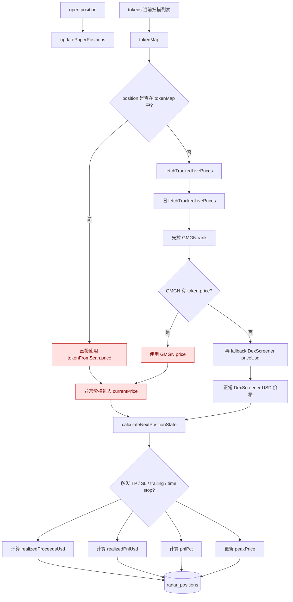
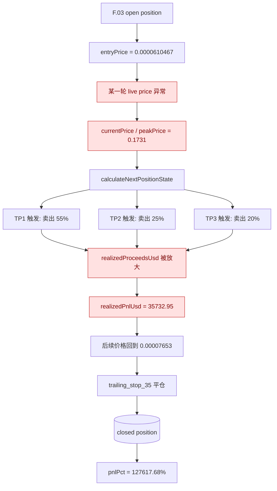
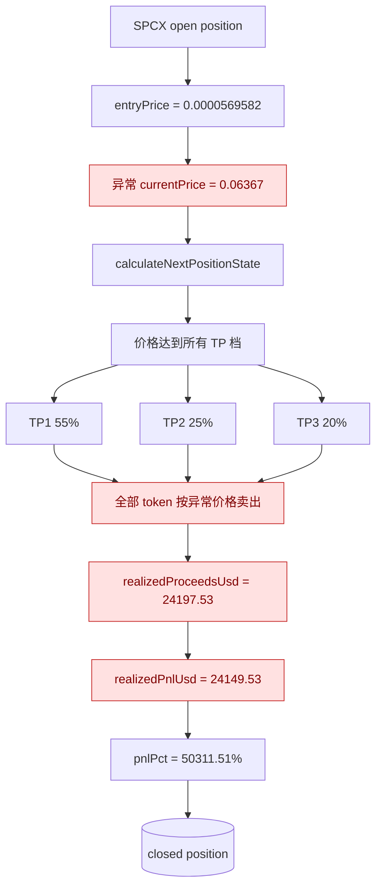
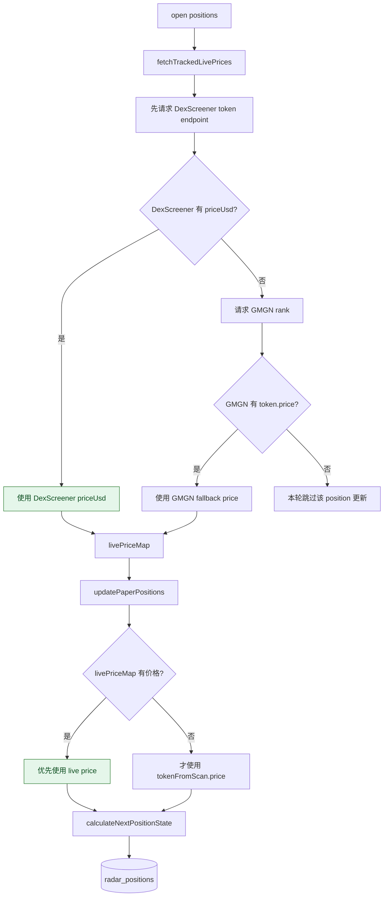

# 已平仓收益异常排查

## 现象

已平仓列表中有 2 条收益明显不符合实际价格走势：

- `DkaY3z9hYutckCNoLCy8kfJvrDEDwjojQ9zL1s4Fpump` / `F.03`
  - 记录收益：`+127617.68%`，`+$35732.95`
  - 记录入场价：`0.0000610467`
  - 记录收盘价：`0.00007653`
  - 记录峰值价：`0.1731`
- `6ymvbHWYqA8QdfZEqp3UVipqefpfzd5NYK8hYr4nX2Wz` / `SPCX`
  - 记录收益：`+50311.51%`，`+$24149.53`
  - 记录入场价：`0.0000569582`
  - 记录收盘价：`0.06367`
  - 记录峰值价：`0.06367`

原始排查数据已缓存到：

- `logs/5-17/data.json`

## 关键证据

### SPCX

DB 中 position：

- `position_size_usd = 48`
- `token_amount = 842723.260215`
- `entry_price = 0.0000569582`
- `close_price = 0.06367`
- `realized_proceeds_usd = 24197.53`
- `realized_pnl_usd = 24149.53`

但同一 token 的 alert / trade intent 历史价格量级在：

- `0.000101634`
- `0.000111531`
- `0.000114893`
- `0.000122452`
- `0.000126793`
- `0.000137182`

当前 DexScreener `priceUsd` 也在 `0.000045~0.000049` 量级。

所以 `close_price = 0.06367` 明显不是正常 USD token price，导致 `842723 * 0.06367` 这种计算直接放大出 5 万点级收益。

### F.03

DB 中 position：

- `position_size_usd = 28`
- `token_amount = 458665.251357`
- `entry_price = 0.0000610467`
- `close_price = 0.00007653`
- `peak_price = 0.1731`
- `realized_pnl_usd = 35732.95`
- `close_reason = trailing_stop_35`

`close_price` 本身只比 `entry_price` 高约 `25.36%`，不可能产生 `+$35732.95`。

异常来自中途 `peak_price = 0.1731`：纸上交易引擎先按这个异常高价触发 3 档 TP 卖出大部分仓位，把 `realized_proceeds_usd` 写大；之后价格回到 `0.00007653` 时触发 trailing，但已实现收益已经被污染。

当前 DexScreener `priceUsd` 是 `0.00008067` 左右，和 `0.1731` 差约 2000 倍。

## 根因

问题在 live price 更新链路，不在前端展示。

相关代码：

- `src/modules/signals/server/live-price-snapshot-service.js`
- `src/modules/signals/server/paper-position-lifecycle-service.js`

旧逻辑中：

1. `fetchTrackedLivePrices()` 优先调用 GMGN rank 数据。
2. 只在 GMGN 没有返回价格时，才 fallback 到 DexScreener。
3. `updatePaperPositions()` 如果 open position 也出现在当前扫描 token 列表中，会直接使用扫描 token 的 `price`，不会再取 DexScreener live price。

这导致一旦 GMGN rank 返回了异常量级的 `token.price`，纸上持仓引擎会把这个价格当成 USD 价格写入：

- `current_price`
- `peak_price`
- `realized_proceeds_usd`
- `realized_pnl_usd`
- `pnl_pct`

由于 `paper-position-engine` 的计算本身是按输入价格做数学推进，所以异常价格一进入，就会永久污染已平仓结果。

## 调用流程图

### Worker 单轮扫描主流程

```mermaid
flowchart TD
    A[npm run signal:worker] --> B[scripts/signal-worker/run.js]
    B --> C[import src/signal-scanner.js]
    C --> D[scanSignals = scanNarratives]
    D --> E[scan-orchestrator-service.scanNarratives]

    E --> F[fetchNewTokens]
    F --> F1[GMGN rank/open_timestamp]
    F --> F2[GMGN rank/swaps]
    F1 --> G[mapGmgnToken]
    F2 --> G
    G --> G1[token.price 来自 GMGN token.price]

    E --> H[trackMomentum(tokens)]
    H --> I[currentAlerts]
    I --> J[buildDrizzleLocalResult]

    J --> K[读取 open positions]
    J --> L[fetchTrackedLivePrices(open positions)]
    J --> M[enrichedTokens]
    K --> L
    L --> M

    M --> N[processTradePlans]
    N --> O[updatePaperPositions]
    O --> P[paper-position-engine.calculateNextPositionState]
    P --> Q[repos.positions.updateById]
    Q --> R[(radar_positions)]
```

### 旧逻辑中的异常价格注入点



这里有两个旧逻辑风险：

- 风险 1：如果 open position 当前也在扫描列表里，`updatePaperPositions()` 直接用 `tokenFromScan.price`，不会走 DexScreener 校验。
- 风险 2：即使走 `fetchTrackedLivePrices()`，旧实现也是 GMGN 优先，DexScreener 只在 GMGN 缺失时才使用。

这两个风险都会让异常 GMGN price 进入 `currentPrice`。

### F.03 的污染路径



F.03 的关键点是：最终 `close_price = 0.00007653` 看起来不离谱，只比入场价高约 `25.36%`。真正的问题是中途的 `peak_price = 0.1731` 已经触发了 3 档止盈，把已实现收益写大了。后面 trailing 平仓只是把这条已经污染的 position 关掉。

### SPCX 的污染路径



SPCX 的关键点是：异常 `close_price = 0.06367` 直接作为全仓/分批止盈的成交价格写入，所以收益被一次性放大。

### 修复后的价格优先级



修复后的判断重点：

- 已平仓异常的历史污染不会自动恢复，因为错误值已经写进 `radar_positions`。
- 后续 open position 的 mark price 会先走 DexScreener `priceUsd`。
- 当前扫描 token 的 GMGN price 只作为最后 fallback，降低再次污染持仓生命周期的概率。

## 已做修复

已修改：

- `src/modules/signals/server/live-price-snapshot-service.js`
  - live mark price 优先使用 DexScreener `priceUsd`
  - GMGN rank 只在 DexScreener 没有价格时作为 fallback

- `src/modules/signals/server/paper-position-lifecycle-service.js`
  - 每轮对所有 open positions 拉取 live price
  - 更新持仓时优先使用 live price map
  - 只有 live price 缺失时才 fallback 到当前扫描 token price

这个修复可以防止后续 open position 再被异常 GMGN 价格写坏。

## 后续建议

已有的两条 closed position 已经被异常价格污染。要修复历史数据，需要按可信价格源重放这两个 token 在持仓期间的价格序列，或至少人工回滚这两条 position 的 `realized_* / pnl_pct / peak_price / close_price`。

短期可选处理：

- 先在报表层排除这两个 position，避免总收益被污染。
- 或用 DexScreener 当前/历史可得价格人工修正，但这会改变历史回测结果，建议单独记录一次数据修复说明。
